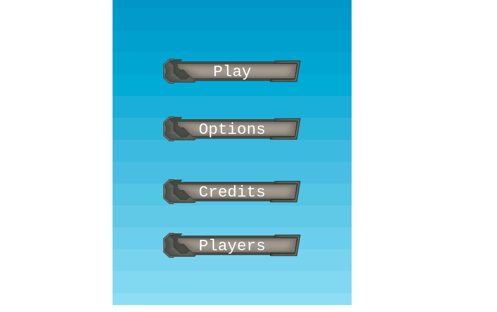
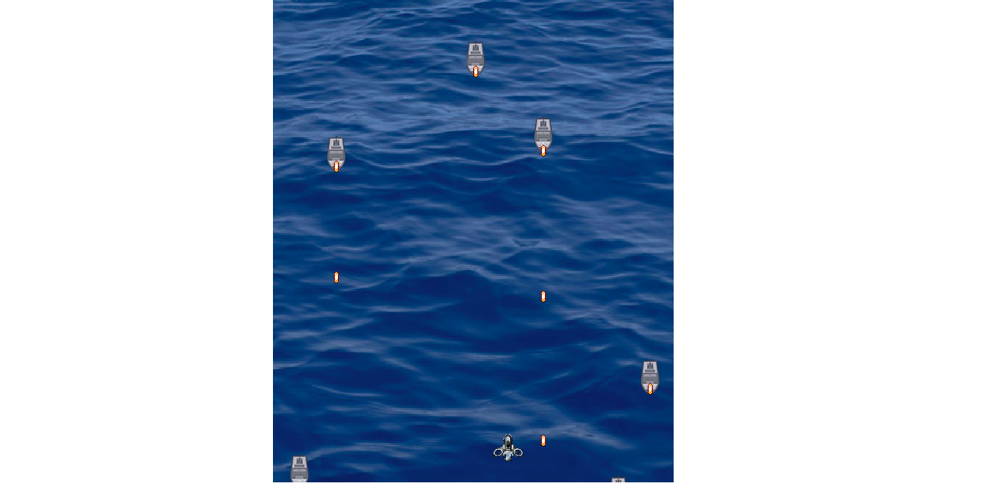

# SHOOTER GAME

> This project is based on creating a shooter game with Phaser 3. Players get to register using a name and play game by killing opponent ships.

### Options Menu:

### Game Scene:

## [Game Design Documentation](./GDD.md)

## Built With

- HTML
- JAVASCRIPT
- PHASER 3
- NPM
- WEBPACK
- BABEL
- JEST

#### [Play Game]('https://determined-shaw-27cf19.netlify.app/')

## Instructions to Play

Play with the Arrows:

- ARROW UP move you UP
- ARROW DOWN move you DOWN
- ARROW LEFT move you LEFT
- ARROW RIGHT move you RIGHT

- And press SPACE to SHOOT

### Getting Started

- Go to your terminal
- Enter `git clone https://github.com/wandji20/Shooter-Game`
- Go to the project folder with `cd Shooter-Game`

### Setup

- Inside the project folder
- Run `npm install`
- Run `npm start`
- On your browser, make sure you point to the right address (i.e: http://localhost:8080/)

test` to run all the tests.

### JEST

- Run `npm test` to see test results

## Author

👤 Wandji Bertrand

- Github: [@wandji20](https://github.com/wandji20)
- Twitter: [@wandjibertrand](https://twitter.com/wandjibertrand)
- Linkedin: [Linkedin](https://www.linkedin.com/in/wandji-bertrand/)

## 🤝 Contributing

Contributions, issues and feature requests are welcome!

## Show your support

Give a ⭐️ if you like this project!

## Acknowledgments 🚀

- [Inspire To Educate](http://inspiredtoeducate.net/)
- [York Computer Solutions LLC](https://learn.yorkcs.com/)
- https://opengameart.org/

## 📝 License

This project is [MIT](LICENSE) licensed.
